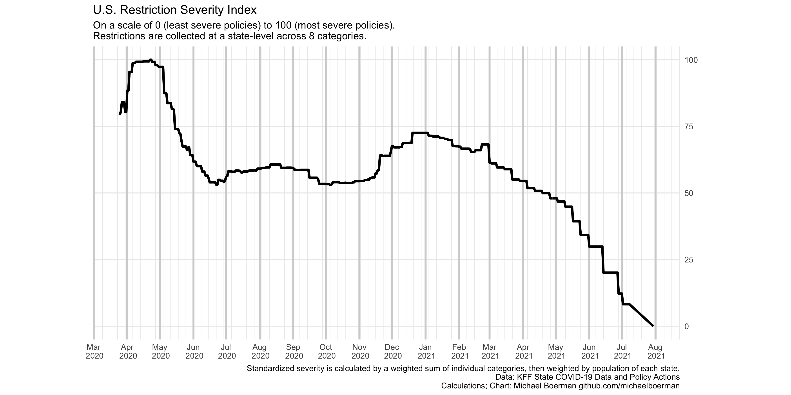
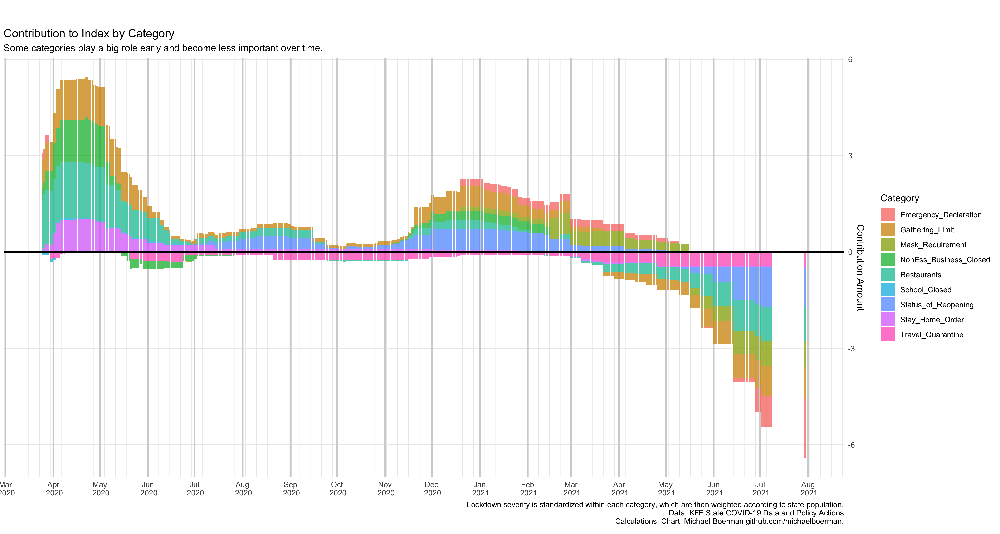
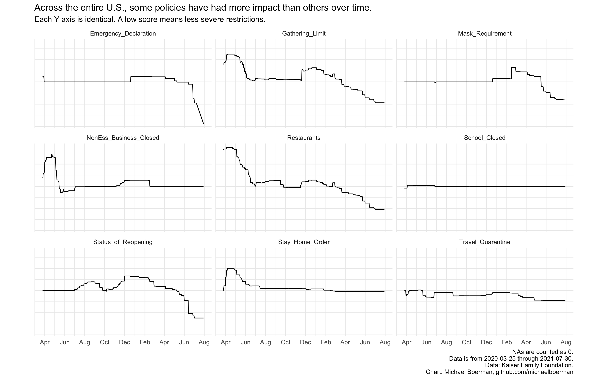
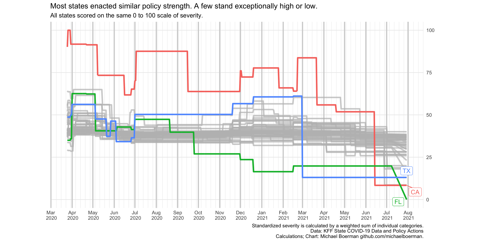

# Pandemic Lockdown Severity Index

*As of summer 2021, this project is no longer being updated. Mostly because I thought COVID wasn't going to be a thing anymore... but also the fad of categorical aggregation caught attention from powerhouses larger than myself, most evident by the [Oxford Stringency Index](https://covidtracker.bsg.ox.ac.uk). I reccomend using their data set instead of mine.*

## Overview
We all want to know if lockdowns work. They would be a huge price to pay if not! In order to understand a relationship between cause and effect, both must be measured. We need to understand the severity of lockdowns – the cause – before we can do any regression or correlation analysis with death toll or economic impact – the effects. Metrics for these effects exist, but understanding the cause poses a challenge. The index presented here offers a useful measure to understand the severity of lockdown restrictions. It is available for each of nine individual lockdown categories, for each of the fifty states, and aggregated into one measure for the whole United States. 

Many great indices exist in this vein, but the Pandemic Lockdown Severity Index provides two novel features:
1)	Weighted by population of each state.
2)	Each category is standardized to impose equal weighting.

The first ensures California holds more weight than Alaska, for example, in the US-wide index. The second ensures that, regardless of the number of levels within each category, each hold an equal importance. Each of these also provide the opportunity for the user to modify the index with demographic, epidemiologic, or economic significance by adding external weights. 

## National-Level Plots

## State-Level Plots

## Terminology
Terminology:
-	**Pandemic Lockdown Severity Index**: name of the population-weighted, standardized, nation-wide series measuring severity of lockdowns. Can also be written as Lockdown Severity Index, or, in context, just the Index.
-	**Category**: a categorical variable, also called a factor. The Index comprises nine categories and are listed in the appendix. Opposed to a continuous variable, which may contain *any number* (temperature, age), or a discrete variable, which may contain *any whole number* (number of people, number on a dice), a categorical variable contains a *character string*.
-	**Level**: the character string of a categorical variable. Categories are comprised of up to seven levels (strings) and are listed in the appendix. 
- 	Standardize: a process of shifting and scaling data. It comprises two steps:
	1) subtract the mean of the series from each data point (shift)
	2) divide each of these values by the standard deviation of the series (scale)

Formulaically, this looks like the following. For each date *t* of *value* of a series *s*, 

    
The purpose of this is discussed in the methodology section.

- **Population-weighted:** a process of scaling data by a weight. Here, the weight is the fraction of population the state owns out of the total United States population (50 states + DC). 

Formulaically, this looks like the following. For each date *t* of *value* in a series for each state *s*, 
    

    
The purpose of this is discussed in the methodology section. 

## Methodology
This index is created by a series of weighted averages of standardized data series. The data's raw form is words (e.g., "mask required in public", "all non-essential retail business closed") and it is mapped to numbers on a scale of severity, using human judgment.\* For the "cookbook" of mapping, [see this code](https://github.com/michaelboerman/lockdown_severity_index/blob/main/Code/data_prep_code/021_make_factor_levels.R#L39). 

Despite the numerical values, it is still a discrete data set and cannot be treated as continuous. A value of 2 is not necessarily twice as severe as a value of 1. Nor is a 4 quadruple the intensity of 1. The only conclusion of the scale is that a 4 is worse than a 1. Thus, traditional methods such as PCA or factor analysis are unavailable. 

However, to account for difference in the number of levels within each category, I standardize each series individually. This puts all the categories on an equal playing field and handles outliers well. This step is absolutely crucial.

An optional but valuable step is to weight each state's severity by it's relative population prior to national aggregation. Unlike the Oxford Stringency Index, which is a top-down approach, I build up from each individual state's individual categories. Thus, when aggregating into a national index, I aggregate across two dimensions: geographic (states) and value (categories). I choose to weight the states by population but leave the categories unweighted. Weights could be assigned externally to count one category more important than another, but I omit this research-intensive step.

Becuase I aggregate across two dimensions to build up, indivudual plots exist. For each state's single index, see [this folder](https://github.com/michaelboerman/lockdown_severity_index/tree/main/Results/plots/state_index). For each state's categorical decomposition, see [this folder](https://github.com/michaelboerman/lockdown_severity_index/tree/main/Results/plots/state_categories). For the US index created without population-weighting or without category standardization, [see this folder](https://github.com/michaelboerman/lockdown_severity_index/tree/main/Results/plots/unused_intermediates).

At the end, I re-scale the series from 0 (least severe instance) to 100 (most severe instance). This takes the series from an arbitrary number to a relative scale, and indeed allows for mulitplicative and additive comparison: for instance, 100 is twice as severe as 50, and the change in severity from 10 to 20 is equal that to the change from 90 to 100. 

\*This method has received some [justified critiscism](https://www.aier.org/article/oxfords-stringency-index-is-falling-apart/).

## Data
Data about the lockdown restrictions is collected for each state from the [Kaiser Family Foundation's Covid Policy Report](/https://www.kff.org/report-section/state-covid-19-data-and-policy-actions-policy-actions/). Vintage data is collected using the Way Back Machine(https://archive.org/web/) and stored as one csv per date, containing all 50 states + DC. 

There are approximately 18 categories that are filtered down to 9 (some are merged, some are ignored altogether). 

*Original Factors:*
- Location     
- Date   
- Stay at Home Order  
- Stay At Home Order 
- Status of Reopening                       
- Non-Essential Business Closures
- Large Gatherings Ban   
- Emergency Declaration 
- Mandatory Quarantine for Travelers             
- Restaurant Limits 
- Bar/Restaurant Limits                
- Bar Closures                                  
- Bar Closures*
- State-Mandated School Closures            
- School Closures
- State Is Easing Social Distancing Measures                        
- Face Covering Requirement 
- Mandatory Quarantine
- Primary Election Postponement            

*Cleaned Factors:*
- Location           
- Date       
- Stay_Home_Order     
- Status_of_Reopening   
- NonEss_Business_Closed
- Gathering_Limit 
- Emergency_Declaration 
- Travel_Quarantine     
- Mask_Requirement     
- Restaurants         
- School_Closed
   

Each of these 9 categories have between 1 and 7 levels, stored as text strings such as “take out only” or “masks for general public required”. 

These factor levels are re-ordered to reflect their level of severity using human judgment. Then, a number from 0 to the number of levels is matched to each level. 0 is reserved for NAs, “-“, or otherwise blank data. These new numbers are all integers. 

## Code Structure
This is written entirely in R. The repo contains all code and data necessary to reproduce all series and can be sourced sequentially. 
The code is ordered numerically and roughly follows this outline:

- `010_compile_kff_data`: read in csv from each date containing 18 categories. Merges similar categories together and cleans up similar levels within each category. Formats and exports as csv in long form.

- `012_gather_populations`: read in csv with US Census 2020 state population estimates. Format and export as csv.

- `021_make_factor_levels`: reorders category levels and assigns severity score to each level.
- 
- `024_merge_populations`: merges the result from above with the population data from two above. format and export as csv to use for all plots.

- `032_plot_raw_series`: plots the "raw" series (not population weighted and not standardized). 

- `035_plot_std_series`: first, it standardizes the data (shift by mean and scale by std dev). Then, create plots.

- `037_plot_pop_series`: first, it weights each state by population (multiply by state_pop/total_pop). Then, create plots.

- `038_plot_std_pop_series`: first, it standardizes the data. Second, it weights by population. Then, create plots. *(final output)*

- `039_plot_states`: creates in parallel plots for individual states (index, barchart decomposition, and facet wrapped decomposition). 

## Acknowledgments 
I'd like to thank Alessandro Barbarino for input and mentorship, and Jaclyn Lee for help problem-solving code.
The lockdown data originate from the [Kaiser Family Foundation](https://www.kff.org/report-section/state-covid-19-data-and-policy-actions-policy-actions/). Thank you for making your [data publicly available!](https://github.com/KFFData/COVID-19-Data/tree/kff_master/State%20Policy%20Actions/State%20Social%20Distancing%20Actions)

